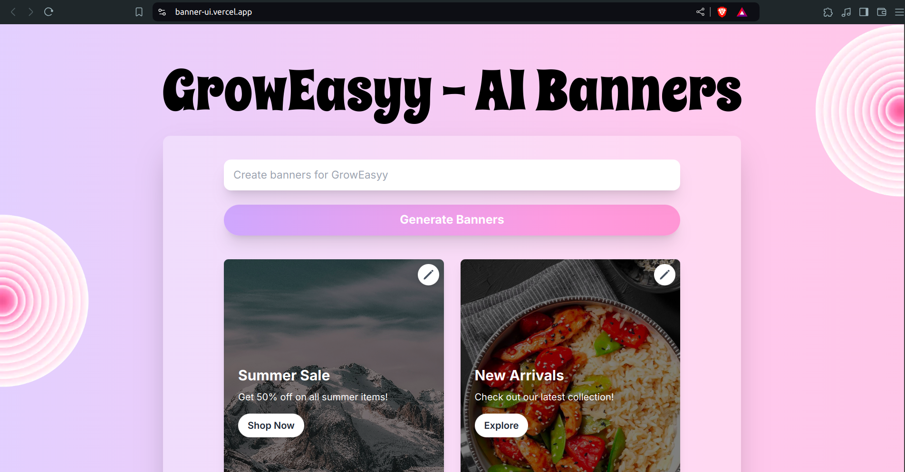

<h1 align="center">GrowEasyy - AI Banners</h1>
<p align="center">
  
</p>


## Technology used: 


## Project Setup

1. **Clone the repository**
```
git clone https://github.com/Thanisha23/banner-UI.git
```

2. **Navigate to the project directory and install dependencies for the backend**

 ```
pnpm install
```

3. **Start the server**
```
pnpm run dev
```

<div align="center"><h4>More better projects to come soon!😁👀</h4></div>
<div align="center"><h4>Made by Thanisha Belchada</h4></div>
